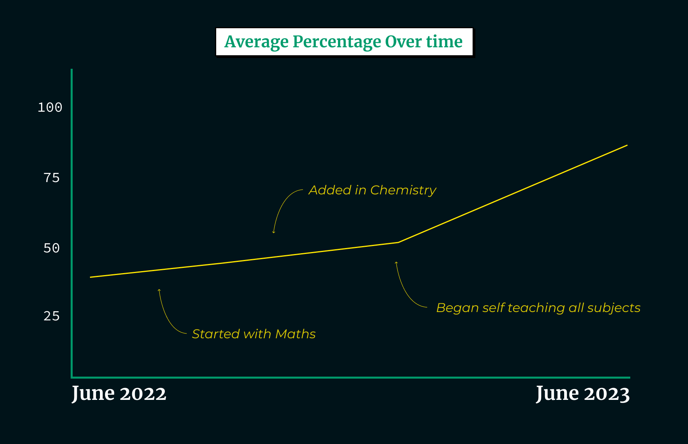

:toc:
:toclevels: 4
:figma: https://www.figma.com
:sass: https://sass-lang.com

= Points Lab

== What is Points Lab?

Points Lab is an online learning platform aimed at making the Irish second level education system more accessible to daydreamers. Students get access to video tutorials (in extremely high quality) and exam questions, topic by topic.

=== No, what is Points Lab, really?

Points Lab is my very first attempt at building a web frontend.

I wanted to build something from the mindset that it would be a product that I could sell online as a service. I did some investigating on how others do this professionally and tried to follow what seems to be some of the best practices of today and to learn some of the tools along the way.

For more on this, see link:#my-goals-and-learnings-while-making-points-lab[My goals and learnings while making Points Lab].

== My goals and learnings while making Points Lab

Since this is my first attempt at a website, I wanted to keep a narrow scope in terms of what I would try to learn. Therefore I kept it to the following:

1. *Design*: Learn how to use {figma}[Figma] to plan out and designing a website for a product like Points Lab.
2. *Development*: Learn how to use HTML and CSS (via {sass}[SASS]) to implement the {figma}[Figma] design.
  * I also wanted to use this opportunity to learn how to use Git/GitHub to maintain a good change history for the work I was doing.

NOTE: I intentionally didn't get into Javascript etc. on this project.

=== Designing with Figma

Making Points Lab was a good experience all the way from design to development. I already had a lot of experience with graphics because of my experience with the Adobe suite, so designing this on {figma}[Figma] was a breeze.

*Mikey TODO*: Add some details about how Figma helps e.g. developing and clarifying ideas ... communicating the design to those that will implement the website etc etc

==== Figma Source

The sources for the {figma}[Figma] design are in the link:./figma[figma] folder.

=== Implementing with HTML and CSS/SASS

*Mikey TODO*: Something about learning HTML

I decided to develop the CSS/styling in {sass}[SASS] to try the structural and organisation benefits Vs raw CSS. I used Visual Studio Code (with the SaSS extension installed) as my IDE.

In retrospect, I don't think that I took full advantage of the perks of {sass}[SASS], and due to my inexperience wasn't as organised as I could have been especially with the media queries, and maybe I overcomplicated the responsiveness. Apart from that I do think that I did a fairly good job on the frontend for my first real attempt at a web page.

==== HTML and SASS sources

The HTML and SASS sources are in the link:./pointsLab-codeContents[pointsLab-codeContents] folder.

== Where the idea for Points Lab came from

Growing up I was always a dreamer and was never overly interested in school. I was doing poorly and decided to make a change, which proved to be remarkably effective. Here are the results of the solution that I found:
NOTE: My results went from 194 in June 2022 to 498 in June 2023. Exams in 2022 are scored on topics covered between January 2022 and June 2022. Exams in 2023 are scored on topics covered between September 2021 and June 2023.

By going on this self teaching journey I gained the confidence that I wasn't lacking intelligence, but just wasn't suited to the traditional system of school - and with that realisation came the idea of Points Lab. Points Lab enhances my solution further by making it even more convenient and efficient.